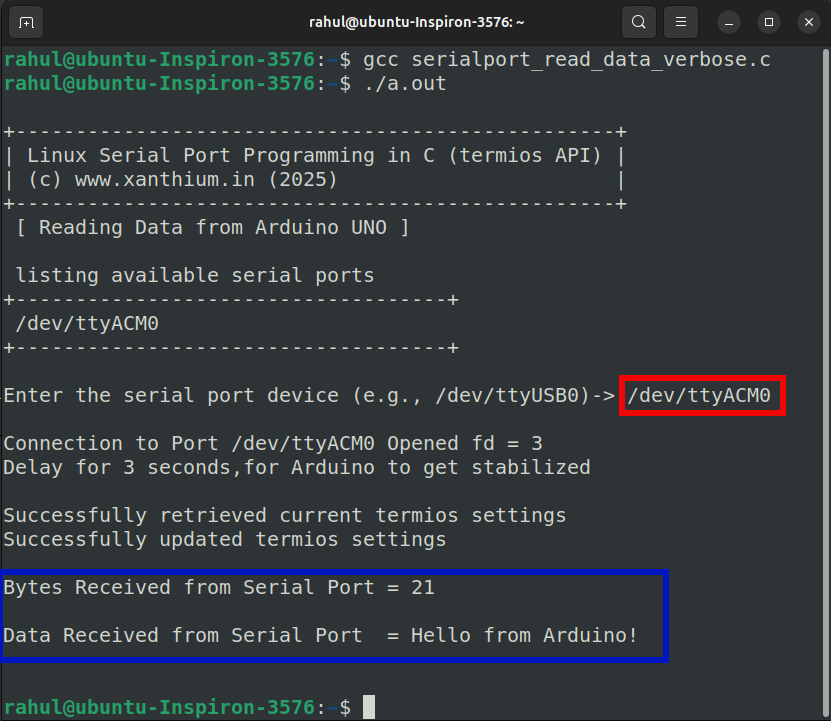
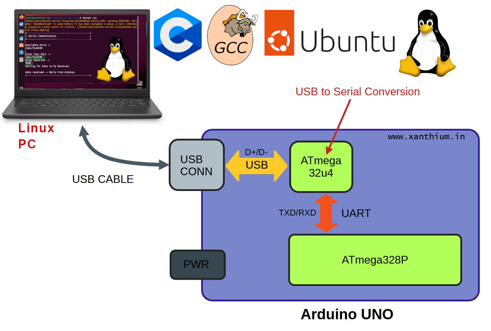
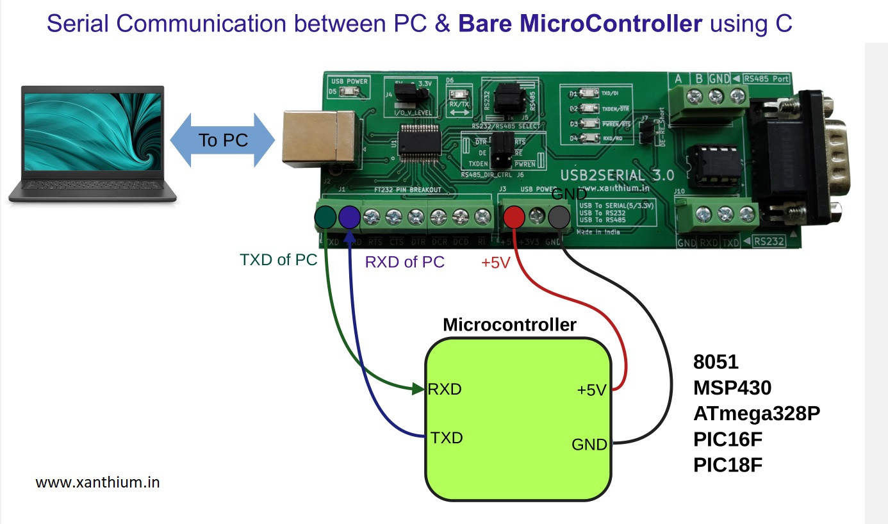

# Linux Serial Port Programming Tutorial using C Language and termios API

- In this repo ,You will find code for programming the serial port of your Linux distribution(Ubuntu,Fedora,Arch,Linux Mint) using C language.
- We will also Learn to perform Bi-Directional Serial Communication between a Linux PC and an Arduino UNO
- Here we will be using the native API's provided by the Linux System like the
  - **termios** structure.
  - **read()** system call
  - **write()** system call
-  to configure the serial port of our linux system.
-  Code is written in **Pure C** language and compiled using **GCC**.

 

## Online Tutorial
A detailed writeup of the Linux serial Port Programming tutorial can be found using the below link 
- [Linux Serial Port Programming tutorial for the Absolute Beginner](https://www.xanthium.in/native-serial-port-communication-arduino-micro-linux-unix-bsd-system-c-lang-terminos-api)

## Hardware Connections
 
 
 
 The above image shows how to connect the Arduino board with the Linux PC for Serial Communication.

 
 
 The above image shows how to interface bare microcontrollers like 8051,ATmega328P,MSP430 with linux serial port using a [USB to Serial Converter](https://www.xanthium.in/USB-to-Serial-RS232-RS485-Converter).

## Compiling the Code.

The Code can be compiled using GCC on any modern Linux Systems.

## Screen shots
